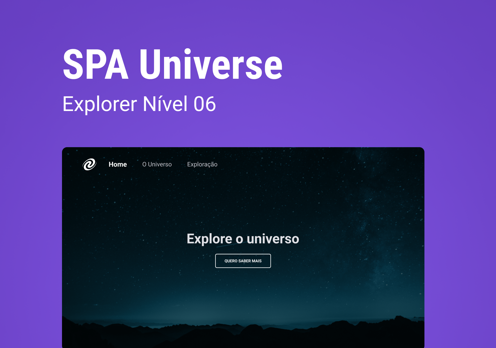

  <a href="#-tecnologias">Tecnologias</a>&nbsp;&nbsp;&nbsp;|&nbsp;&nbsp;&nbsp;
  <a href="#-projeto">Projeto</a>

  

## 🚀 Tecnologias

Esse projeto foi desenvolvido com as seguintes tecnologias:

- HTML
- CSS
- JavaScript
- Git e Github
- Figma

Bibliotecas

- [Google Fonts](https://fonts.google.com/)

## 💻 Projeto

é uma simples aplicação de troca de pagina e para fazer essa aplicação usei:

- Conceitos de SPA;
- Mapeamento de rotas;
- Assíncrono e promisses;
- Orientação a objetos;
- Classes e muito mais.

Também aprendi a criar um servidor local simples com NodeJs.

- [Acesse o projeto finalizado, online](https://lkaua22k.github.io/SPA_Universe/)

---

Feito com ♥ by Kauã :wave: